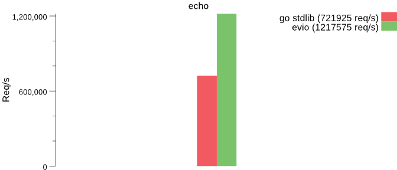
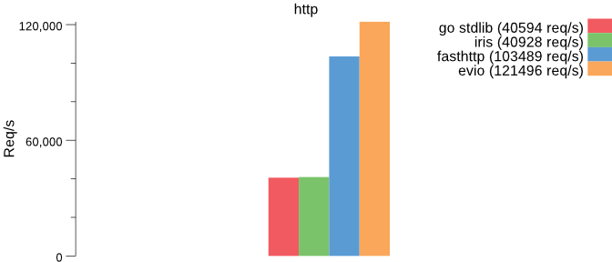
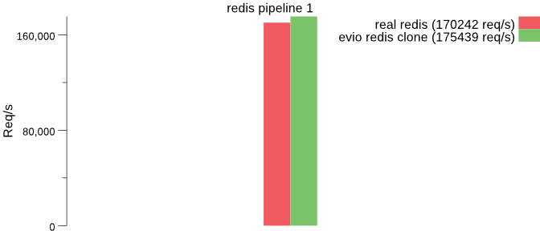
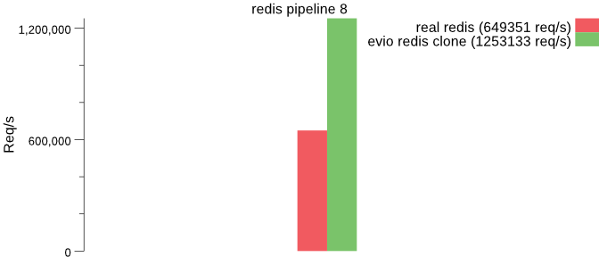
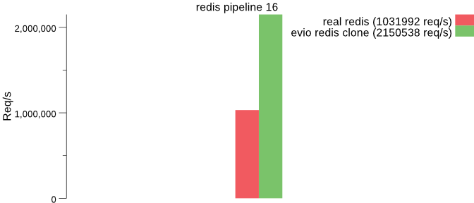

<p align="center">

<br>
<a href="https://travis-ci.org/tidwall/evio"></a>
<a href="https://godoc.org/github.com/tidwall/evio"></a>
</p>

`evio` is an event loop networking framework that is fast and small. It makes direct [epoll](https://en.wikipedia.org/wiki/Epoll) and [kqueue](https://en.wikipedia.org/wiki/Kqueue) syscalls rather than using the standard Go [net](https://golang.org/pkg/net/) package, and works in a similar manner as [libuv](https://github.com/libuv/libuv) and [libevent](https://github.com/libevent/libevent).

The goal of this project is to create a server framework for Go that performs on par with [Redis](http://redis.io) and [Haproxy](http://www.haproxy.org) for packet handling. My hope is to use this as a foundation for [Tile38](https://github.com/tidwall/tile38) and a future L7 proxy for Go... and a bunch of other stuff.

## Features

- [Fast](#performance) single-threaded event loop
- Simple API
- Low memory usage
- Supports tcp4, tcp6, and unix sockets
- Allows [multiple network binding](#multiple-addresses) on the same event loop
- Flexible [ticker](#ticker) event
- Fallback for non-epoll/kqueue operating systems by simulating events with the [net](https://golang.org/pkg/net/) package
- Ability to [wake up](#wake-up) connections from long running background operations

## Getting Started

### Installing

To start using evio, install Go and run `go get`:

```sh
$ go get -u github.com/tidwall/evio
```

This will retrieve the library.

### Usage

Starting a server is easy with `evio`. Just set up your events and pass them to the `Serve` function along with the binding address(es). Each connections receives an ID that's passed to various events to differentiate the clients. At any point you can close a client or shutdown the server by return a `Close` or `Shutdown` action from an event.

Example echo server that binds to port 5000:

```go
package main

import "github.com/tidwall/evio"

func main() {
	var events evio.Events
	events.Data = func(id int, in []byte) (out []byte, action evio.Action) {
		out = in
		return
	}
	if err := evio.Serve(events, "tcp://localhost:5000"); err != nil {
		panic(err.Error())
	}
}
```

Here the only event being used is `Data`, which fires when the server receives input data from a client.
The exact same input data is then passed through the output return value, which is then sent back to the client. 

Connect to the echo server:

```sh
$ telnet localhost 5000
```

### Events

The event type has a bunch of handy events:

- `Serving` fires when the server is ready to accept new connections.
- `Opened` fires when a connection has opened.
- `Closed` fires when a connection has closed.
- `Detach` fires when a connection has been detached using the `Detach` return action.
- `Data` fires when the server receives new data from a connection.
- `Prewrite` fires prior to all write attempts from the server.
- `Postwrite` fires immediately after every write attempt.
- `Tick` fires immediately after the server starts and will fire again after a specified interval.

### Multiple addresses

An server can bind to multiple addresses and share the same event loop.

```go
evio.Serve(events, "tcp://192.168.0.10:5000", "unix://socket")
```

### Ticker

The `Tick` event fires ticks at a specified interval. 
The first tick fires immediately after the `Serving` events.

```go
events.Tick = func() (delay time.Duration, action Action){
	log.Printf("tick")
	delay = time.Second
	return
}
```

### Wake up

A connection can be woken up using the `wake` function that is made available through the `Serving` event. This is useful for when you need to offload an operation to a background goroutine and then later notify the event loop that it's time to send some data.

Example echo server that when encountering the line "exec" it waits 5 seconds before responding.

```go
var wake func(id int) bool
var mu sync.Mutex
var execs = make(map[int]int)

events.Serving = func(wakefn func(id int) bool, addrs []net.Addr) (action evio.Action) {
	wake = wakefn // hang on to the wake function
	return
}
events.Data = func(id int, in []byte) (out []byte, action evio.Action) {
	if in == nil {
		// look for `in` param equal to `nil` following a wake call.
		mu.Lock()
		for execs[id] > 0 {
			out = append(out, "exec\r\n"...)
			execs[id]--
		}
		mu.Unlock()
	} else if string(in) == "exec\r\n" {
		go func(){
			// do some long running operation
			time.Sleep(time.Second*5)
			mu.Lock()
			execs[id]++
			mu.Unlock()
			wake(id)
		}()
	} else {
		out = in
	}
	return
}
```

### Data translations

The `Translate` function wraps events and provides a `ReadWriter` that can be used to translate data off the wire from one format to another. This can be useful for transparently adding compression or encryption.

For example, let's say we need TLS support:

```go
var events Events

// ... fill the events with happy functions

cer, err := tls.LoadX509KeyPair("certs/ssl-cert-snakeoil.pem", "certs/ssl-cert-snakeoil.key")
if err != nil {
	log.Fatal(err)
}
config := &tls.Config{Certificates: []tls.Certificate{cer}}

// wrap the events with a TLS translator

events = evio.Translate(events, nil, 
	func(id int, rw io.ReadWriter) io.ReadWriter {
		return tls.Server(evio.NopConn(rw), config)
	},
)

log.Fatal(Serve(events, "tcp://0.0.0.0:443"))
```

Here we wrapped the event with a TLS translator. The `evio.NopConn` function is used to converts the `ReadWriter` a `net.Conn` so the `tls.Server()` call will work.

There's a working TLS example at [examples/http-server/main.go](examples/http-server/main.go) that binds to port 8080 and 4443 using an developer SSL certificate. The 8080 connections will be insecure and the 4443 will be secure.

```sh
$ cd examples/http-server
$ go run main.go --tlscert example.pem
2017/11/02 06:24:33 http server started on port 8080
2017/11/02 06:24:33 https server started on port 4443
```

```sh
$ curl http://localhost:8080
Hello World!
$ curl -k https://localhost:4443
Hello World!
```

## More examples

Please check out the [examples](examples) subdirectory for a simplified [redis](examples/redis-server/main.go) clone, an [echo](examples/echo-server/main.go) server, and a very basic [http](examples/http-server/main.go) server with TLS support.

To run an example:

```sh
$ go run examples/http-server/main.go
$ go run examples/redis-server/main.go
$ go run examples/echo-server/main.go
```

## Performance

### Benchmarks

These benchmarks were run on an ec2 c4.xlarge instance in single-threaded mode (GOMAXPROC=1) over Ipv4 localhost.
Check out [benchmarks](benchmarks) for more info.




## Contact

Josh Baker [@tidwall](http://twitter.com/tidwall)

## License

`evio` source code is available under the MIT [License](/LICENSE).

